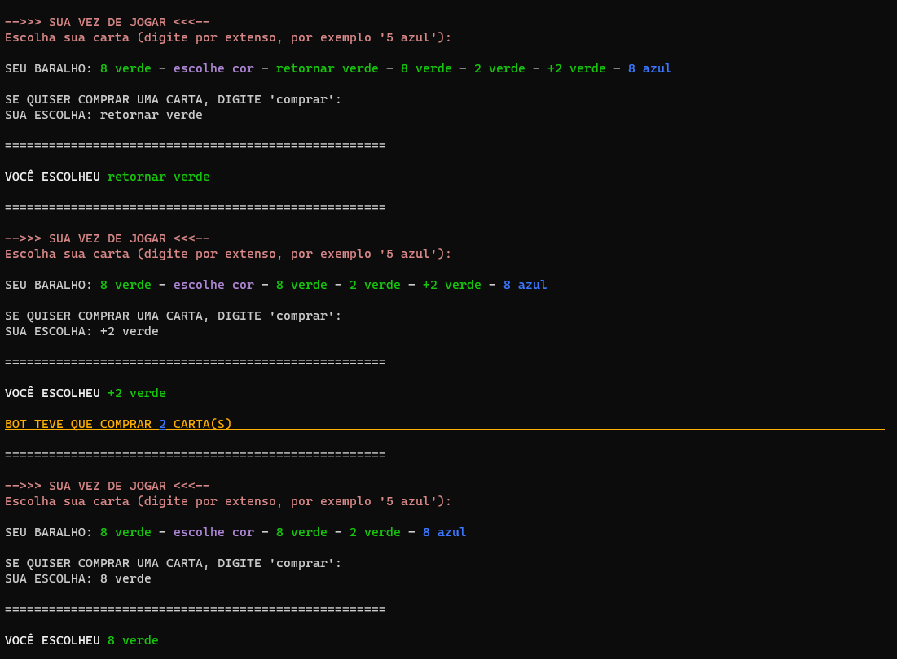
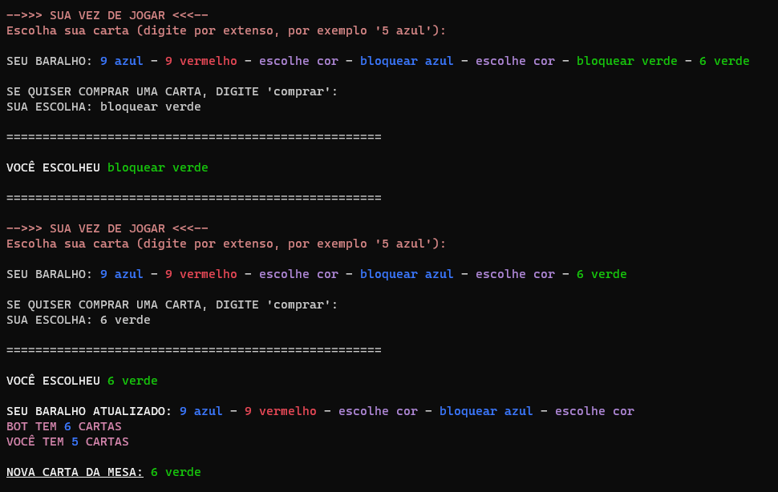

# "UNO" (v.0.1)

#### _Meu projeto de tentativa de recriar um jogo de UNO Player vs CPU_

### > Antes de tudo:

- #### Para rodar o projeto você precisa ter a biblioteca `rich` instalada por causa da formatação;

- #### Para ver as cores e formatação exata do terminal, use o novo Windows Terminal (o clássico só tem 8 cores e vai bugar a formatação toda);

- #### O arquivo .exe está no rar `uno_exe`, extraia todos os arquivos e rode `uno.exe` no novo Windows Terminal (navegue até a pasta e depois digite 'uno');

  

  

- #### Feito em Python 3.8.

  

------

- ### Sobre:

  - **Um remake do UNO em uma aplicação simples em terminal formatado**, onde você joga contra um "bot", que segue uma prioridade de escolhas (descritas no arquivo `prioridade-jogada.txt`), onde você pode recomeçar as partidas. O placar sempre vai aparecer no início de cada partida, e quem começa a partida é escolhido aleatoriamente.

  - **Provavelmente terá atualizações no futuro**, é bom ficar de olho aqui.

#### -> Exemplo da tela inicial (uma tela como essa aparece depois de digitar o número de cartas pra cada jogador, eu digitei '7' aqui como dá pra ver).

#### -> Exemplo de tela depois que a carta é jogada (digitei '2 azul')

------

- ### Regras:

  - #### As regras do jogo aqui nessa v.0.1 são as seguintes:

    - Quem começa o jogo é sempre escolhido aleatoriamente;
    
    - **Não pode jogar +2 em cima de +2 ou +4, e nem +4 em cima de +4**. Se a carta de +2 ou +4 for jogada, o adversário compra as cartas obrigatoriamente, já está programado assim;
    
    - **Quem compra as cartas por causa de uma carta +2 ou +4 não joga**, só na próxima rodada;
    
    - **Só é possível comprar uma carta por vez** (se uma carta que não pode ser jogada for comprada com o comando 'comprar', você não pode comprar outra; o adversário joga);
    
      
    
      
    
    - **Se uma carta que pode ser jogada for comprada, ela automaticamente é jogada pela programação**. Você, nem o bot, tem a opção de guardar a carta para depois (também pretendo mudar isso no futuro);
    
    - **Por enquanto, é possível jogar uma carta coringa (de escolher cor ou +4) por cima de uma outra carta coringa de escolher cor**. Por exemplo, se o bot joga uma coringa de escolher cor e escolhe a cor azul, eu posso tanto jogar cartas azuis quanto cartas coringas (pretendo mudar essa questão no futuro);
    
    - **Se uma carta de retorno ou bloqueio for jogada, quem jogou repete a vez** (porque aqui só tem 2 jogadores e usar essas cartas com apenas 2 pessoas só nos dá essa possibilidade);
    
    - Num jogo normal, caso a pessoa não fale "UNO" ao chegar a 1 carta só, ela é obrigada a comprar acho que 2 cartas. Por enquanto, **aqui o programa fala "UNO" por você e pelo bot automaticamente** (também pretendo mudar isso no futuro);
    
    - **Você pode "manipular" as rodadas quantas vezes você quiser e puder** (você pode jogar 6 cartas de bloqueio e bater de uma vez, nada te impede sem ser o próprio baralho, *que mesmo sendo aleatório ele é meio sacana*).
    
      
    
      

------

- ### Observações:

  - #### **Jogue uma carta por vez**. Mesmo que você vá jogar um bloqueio ou retorne para depois jogar de novo, jogue o retorne/bloqueio, espere a rodada e virar e aí jogue a outra carta;

    

    

  - As cartas são embaralhadas aleatoriamente para depois serem distribuídas;
  
  - O baralho nunca acaba: as cartas da mesa vão sendo adicionadas de novo no final do baralho para não ocorrer erros envolvendo o baralho vazio;
  
  - **O placar zera quando o jogo fecha**, ele só mostra as vitórias daquela vez que o jogo foi aberto;
  
  - Não se engane com o bot: ele só segue ordens mas é horrível ganhar dele kkkkkkkkkkk.
  
    

------

- ### Agradecimentos:

  - Carolina, Claudia e Carina, e Jonathan pelo apoio moral, sugestões e ajuda.